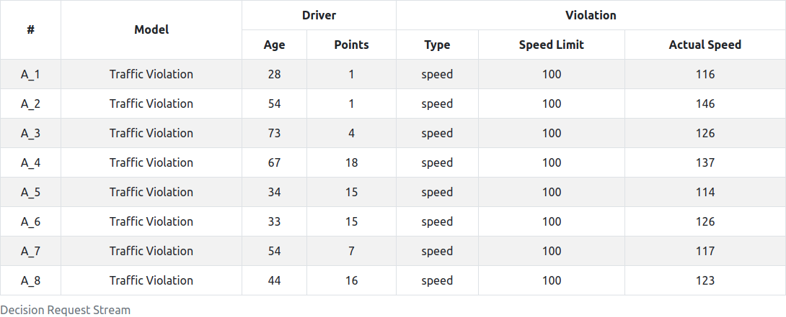
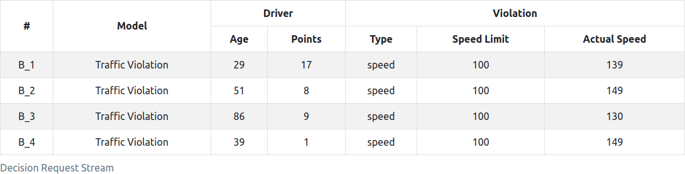
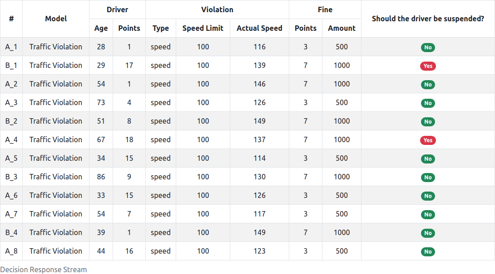

# Streaming decisions with DMN and Kafka

## Description

The code in this repository shows how to stream decision requests via cloud events and evaluate the corresponding decision using the _Kogito Event-Driven Decisions AddOn_. This is based on [this repository](https://github.com/kiegroup/kogito-examples/tree/1.6.x/dmn-event-driven-quarkus).

Using the [Traffic Violation](streaming-dmn-kafka-consumer/src/main/resources/Traffic%20Violation.dmn) decision model as example, producers stream cloud events containing random inputs (`Driver` and `Violation` information) every `x` seconds. The consumer, by its turn, consumes all messages, evaluate and output the decisions made (whether or not the driver should suspended).

## Requirements

- [Java](https://openjdk.java.net/install/) 11 or later
- [Docker Engine](https://docs.docker.com/engine/) and [Docker Compose](https://docs.docker.com/compose/)

## Running through Docker Compose

Clone this repository via SSH:

```
git clone git@github.com:caponetto/streaming-dmn-kafka.git
```

or via HTTPS:

```
git clone https://github.com/caponetto/streaming-dmn-kafka.git
```

Build the code:

```
cd streaming-dmn-kafka && \
./mvnw clean package -f streaming-dmn-kafka-producer/pom.xml && \
./mvnw clean package -f streaming-dmn-kafka-consumer/pom.xml
```

Start up through Docker Compose:

```
docker-compose up -d
```

Once everything is started up, the components will be available at:

- Producer A: http://localhost:8080
- Producer B: http://localhost:8081
- Consumer: http://localhost:8090
- Kafdrop: http://localhost:9000

**Note**: Producers start to generate messages 20 seconds after starting up so you have time to open all the URLs.

## Example

On the URLs above, you are able to check the messages that the producers are sending and the processed messages that the consumer is receiving.

<p align="center">
  
  <br/>
  <span><strong>Producer A</strong>: Generate messages every 5 seconds with random values for Age, Points and Actual Speed.</span>
</p>

<p align="center">
  
  <br/>
  <span><strong>Producer B</strong>: Generate messages every 10 seconds with random values for Age, Points and Actual Speed.</span>
</p>

<p align="center">
  
  <br/>
  <span><strong>Consumer</strong>: Stream of evaluated decisions.</span>
</p>
